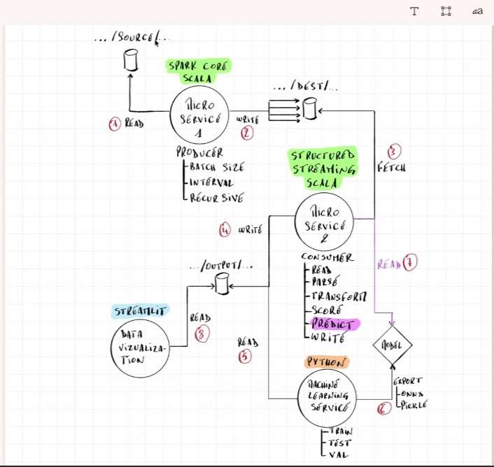

# spark-file-streaming

Simulation de **Spark Structured Streaming** avec Scala et SBT.  
Le projet produit des fichiers par lots (batches) depuis un dossier source vers un dossier de destination, simulant un flux de données en streaming à intervalles réguliers.

> **Contexte pédagogique** : Cours Spark Streaming — ESGI 4ème année

---

## Architecture multi-module

Le projet est organisé en **3 modules SBT indépendants** :

```
spark-file-streaming/
├── build.sbt                              ← build multi-module SBT
├── project/
│   ├── build.properties                   ← version SBT
│   └── plugins.sbt                        ← sbt-assembly
│
├── modules/
│   │
│   ├── common/                            ← utilitaires partagés
│   │   └── src/main/
│   │       ├── resources/
│   │       │   └── logback.xml            ← configuration des logs (niveau WARN)
│   │       └── scala/common/spark/
│   │           └── SparkSessionFactory.scala  ← loan pattern (withSession)
│   │
│   ├── producer/                          ← programme producteur
│   │   └── src/main/
│   │       ├── resources/
│   │       │   └── application.properties ← paramètres du producer
│   │       └── scala/producer/
│   │           ├── FileProducer.scala     ← point d'entrée (main)
│   │           ├── config/
│   │           │   └── ProducerConfig.scala   ← chargeur de config typé
│   │           └── helpers/
│   │               └── FileTransfer.scala     ← wrapper Hadoop FileUtil
│   │
│   └── consumer/                          ← programme consommateur (squelette)
│       └── src/main/
│           ├── resources/
│           │   └── application.properties ← paramètres du consumer
│           └── scala/consumer/
│               ├── StructuredStreamingConsumer.scala  ← point d'entrée (à implémenter)
│               └── config/
│                   └── ConsumerConfig.scala   ← chargeur de config typé
│
├── scripts/
│   └── clean.sh                           ← réinitialise le sandbox de streaming
│
└── data/
    ├── source/                            ← déposer les fichiers à produire ici
    └── destination/                       ← contrat entre producer et consumer
```

---

## Graphe de dépendances des modules

```
producer ──┐
           ├──► common
consumer ──┘
```

- **`common`** n'a aucune dépendance interne
- **`producer`** et **`consumer`** dépendent tous les deux de `common`

---

## Prérequis

| Outil | Version recommandée |
|---|---|
| Java | 17 (OpenJDK) |
| Scala | 2.12.17 |
| SBT | 1.9+ |
| Apache Spark | 3.3.2 |

---

## Configuration

### Producer — `modules/producer/src/main/resources/application.properties`

| Propriété | Description | Valeur par défaut |
|---|---|---|
| `producer.input-dir` | Dossier source des fichiers à envoyer | `data/source` |
| `producer.output-dir` | Dossier de destination (lu par le consumer) | `data/destination` |
| `producer.batch-size` | Nombre de fichiers copiés par lot | `1` |
| `producer.interval-time` | Délai entre deux lots **en secondes** | `5` |

### Consumer — `modules/consumer/src/main/resources/application.properties`

| Propriété | Description | Valeur par défaut |
|---|---|---|
| `consumer.input-dir` | Dossier surveillé en streaming | `data/destination` |
| `consumer.output-dir` | Dossier de sortie des prédictions (CSV) | `data/output` |
| `consumer.checkpoint-dir` | Dossier de checkpoint Spark (fault tolerance) | `data/checkpoint` |
| `consumer.model-path` | Chemin vers le modèle ONNX pré-entraîné | `models/best_distracted_driver_cnn.onnx` |

---

## Lancement

> **Note** : Toutes les commandes Scala/SBT sont à exécuter dans votre terminal **WSL (Ubuntu)** depuis la racine du projet.

### 1. Réinitialiser le sandbox (vide destination, checkpoint, output et copie les images de test)
```bash
bash scripts/clean.sh
```

### 2. Démarrer le consumer (Détection de distractions via modèle ONNX)
```bash
sbt "consumer/run"
```

### 3. Démarrer le Dashboard Streamlit (Visualisation Web)
Dans votre environnement Python (par exemple après avoir activé votre conda env `voice_rec_stable`) :
```bash
python -m streamlit run dashboard/app.py
```

### 4. Démarrer le producer (Simule le flux d'images)
Dans un nouveau terminal :
```bash
sbt "producer/run"
```

### Compiler un seul module
```bash
sbt "common/compile"
sbt "producer/compile"
sbt "consumer/compile"
```

---

## Fonctionnement du producer

1. Chargement de la configuration depuis `application.properties`
2. Initialisation de la `SparkSession` via `SparkSessionFactory.withSession`
3. Listing des fichiers présents dans `data/source/`
4. Découpage en lots de taille `batch-size`
5. Pour chaque lot :
   - Copie de chaque fichier vers `data/destination/` via `FileTransfer.copyFile`
   - Pause de `interval-time` secondes (simulation de l'intervalle de streaming)
6. Arrêt automatique de Spark à la fin du traitement (loan pattern)

```
=== FileProducer (Simulation de streaming) ===
  input-dir     : data/source
  output-dir    : data/destination
  batch-size    : 1 fichier(s) par batch
  interval-time : 5s
=============================================

Envoi depuis 'data/source' vers 'data/destination' par lot de 1 fichier(s), intervalle : 5s
  [OK] Fichier copié : fichier1.txt
  Batch terminé. Attente de 5s avant le prochain lot...
  [OK] Fichier copié : fichier2.txt
  Batch terminé. Attente de 5s avant le prochain lot...

[FIN] Tous les lots ont été traités.
```

---

## Description des fichiers clés

### `common/spark/SparkSessionFactory.scala` — Loan pattern
Centralise la création et l'arrêt de la `SparkSession`.  
Garantit que Spark est **toujours arrêté proprement**, même en cas d'exception.

```scala
SparkSessionFactory.withSession("MonApp") { spark =>
  // Spark est disponible ici
  // Il sera automatiquement arrêté à la sortie du bloc
}
```

### `producer/config/ProducerConfig.scala` — Config typée
Charge `application.properties` et expose chaque paramètre sous forme d'un **case class Scala typé** (pas de `.getProperty("clé")` dispersés dans le code).

### `producer/helpers/FileTransfer.scala` — Wrapper Hadoop
Encapsule `FileUtil.copy` avec des paramètres explicites :
- `deleteSource = false` → le fichier source est **conservé**
- `overwrite = true` → écrase le fichier si déjà présent à destination

### `consumer/StructuredStreamingConsumer.scala` — Pipeline de classification d'images
Point d'entrée du consumer. Il écoute les images entrantes (`png`, `jpg`, `jpeg`), les charge en mémoire, applique un resizing (64x64) et un aplatissement (RGB normalisé), puis les classe à l'aide du modèle ONNX (`best_distracted_driver_cnn.onnx`) en passant un tenseur de rang 4 `[1, 64, 64, 3]`. Les résultats sont cumulés de façon incrémentale dans `data/output/predictions.csv`.

---

## Détection de distractions et Dashboard Streamlit

Le projet intègre une interface graphique interactive développée avec **Streamlit** pour visualiser les résultats en temps réel.

### Fonctionnalités du Dashboard :
- **KPIs en temps réel** : Affiche le nombre total d'images analysées et indique instantanément si le conducteur est attentif ou s'il y a une distraction détectée.
- **Affichage en direct** : Affiche la dernière image captée et traitée par le modèle avec sa classe prédite.
- **Statistiques de détections** : Un graphique dynamique en barres montre la distribution des prédictions à travers les 10 classes de distraction.
- **Galerie d'historique** : Une grille visuelle montre les 8 dernières images analysées avec leurs prédictions respectives tout en bas de la page.
- **Compatibilité multi-plateforme** : Le convertisseur de chemin traduit automatiquement les URI de fichiers Spark pour fonctionner de manière transparente sous Windows natif ou dans WSL.

Les 10 classes détectées sont :
- `c0` : Conduite normale
- `c1` : SMS au volant (Droit)
- `c2` : Téléphone (Droit)
- `c3` : SMS au volant (Gauche)
- `c4` : Téléphone (Gauche)
- `c5` : Réglage Radio
- `c6` : En train de Boire
- `c7` : Se retourner derrière
- `c8` : Maquillage
- `c9` : Parler au passager

---

## Architecture globale

Voici le schéma d'architecture du projet que j'ai réalisé pour bien visualiser les différents composants et leurs interactions :



On voit clairement les 4 microservices qui communiquent entre eux :
- le **Producer** (Spark Core) qui lit les images et les envoie vers `/dest/`
- le **ML Service** (Python) qui héberge le modèle et le distribue
- le **Consumer** (Spark Structured Streaming) qui récupère le modèle, analyse les images et écrit les résultats
- le **Dashboard** (Streamlit) qui lit les résultats et les affiche en temps réel

---

## Ma contribution — Microservice ML Python (branche `ansame-stream`)

Dans la version de base du projet (branche `darky-stream`), le consumer Spark allait chercher le modèle ONNX **directement sur le disque dur** en local. C'est fonctionnel mais ça ne correspond pas vraiment à une architecture microservices réelle.

J'ai donc créé un **microservice ML dédié** en Python avec FastAPI pour que le modèle soit hébergé de façon indépendante et accessible via HTTP, comme dans un vrai projet en production.

### Ce que j'ai ajouté

**Nouveau fichier `ml_service/app.py`**

Un serveur FastAPI avec 4 routes :

| Route | Ce que ça fait |
|---|---|
| `GET /health` | Vérifie que le service tourne bien |
| `GET /model` | Envoie le fichier ONNX au consumer qui le demande |
| `GET /model/info` | Retourne les infos du modèle (classes, dimensions) |
| `POST /predict` | Accepte une image et retourne la prédiction |

**Modifications dans le Consumer Scala**

- Ajout d'une fonction `fetchModelFromService()` dans `StructuredStreamingConsumer.scala` : au démarrage, le consumer appelle `GET /model` pour télécharger le modèle depuis le service au lieu de le lire depuis le disque
- Ajout du champ `modelUrl` dans `ConsumerConfig.scala`
- Ajout de `consumer.model-url = http://localhost:8000/model` dans `application.properties`

Si le service ML n'est pas disponible, le consumer bascule automatiquement sur le fichier local (fallback) pour ne pas planter.

### Pourquoi ce changement ?

Dans un vrai système embarqué avec plusieurs voitures, chaque voiture aurait son propre consumer. Avec l'ancienne version, il faudrait copier manuellement le fichier ONNX sur chaque machine. Avec le microservice, toutes les instances du consumer vont chercher le modèle au même endroit. Si on met à jour le modèle, tout le monde récupère la nouvelle version automatiquement au prochain démarrage.

### Lancer le ML Service

```bash
# Installer les dépendances
pip install -r ml_service/requirements.txt

# Démarrer le service (port 8000)
uvicorn ml_service.app:app --host 0.0.0.0 --port 8000
```

Ensuite lancer le consumer normalement, il va automatiquement chercher le modèle sur `http://localhost:8000/model`.

---

## Stack technique

| Composant | Technologie |
|---|---|
| Langage | Scala 2.12 |
| Framework distribué | Apache Spark 3.3.2 (Core + SQL) |
| Build tool | SBT 1.9 (multi-module) |
| Système de fichiers | Hadoop FileSystem API |
| Logging | Logback (via logback.xml partagé) |
| Packaging | sbt-assembly |
| ML Service | Python 3 + FastAPI + ONNX Runtime |

---

## Remarques Java 17

Spark 3.3.x n'est pas nativement compatible avec Java 17.  
Le `build.sbt` configure automatiquement les options `--add-opens` nécessaires pour contourner les restrictions du module système Java 17 :

```scala
javaOptions ++= Seq(
  "--add-opens", "java.base/java.lang=ALL-UNNAMED",
  // ...
)
```

Ces options sont définies une seule fois dans `commonSettings` et héritées par tous les modules.
